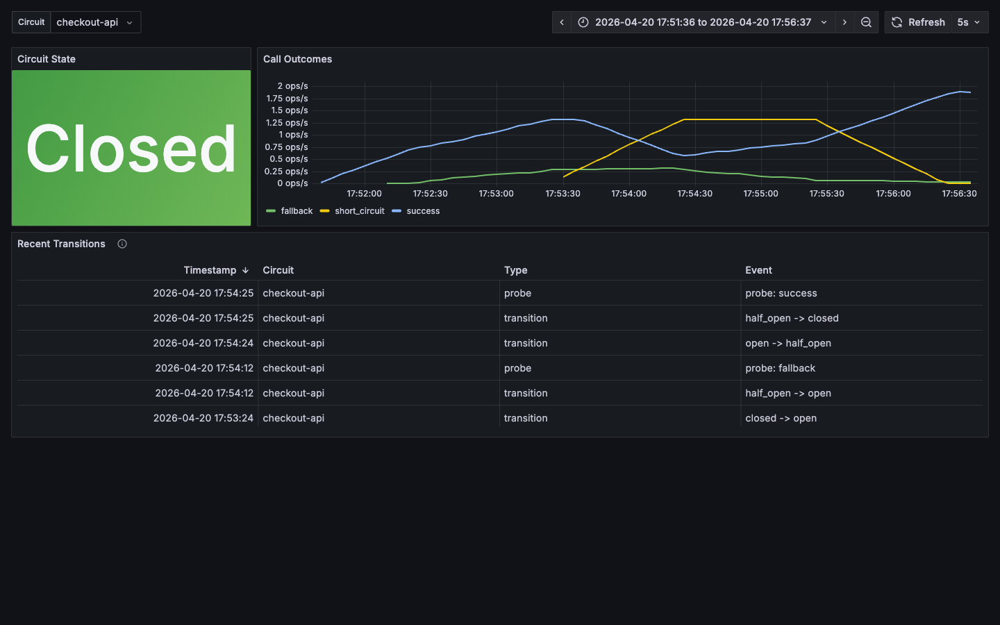

# Circuit Breaker

A lightweight PHP Circuit Breaker implementation to prevent cascading failures in distributed systems.

## Installation

```bash
composer require chiragagg5k/circuit-breaker
```

## What is a Circuit Breaker?

A Circuit Breaker is a design pattern used to detect failures and prevent an application from constantly trying to execute an operation that's likely to fail. This helps prevent cascading failures in distributed systems.

## Features

- ✅ Proper state management (CLOSED, OPEN, HALF_OPEN)
- ✅ Half-open state with gradual recovery
- ✅ Configurable failure and success thresholds
- ✅ Automatic state transitions
- ✅ State inspection methods
- ✅ Simple and lightweight implementation
- ✅ Optional Redis and Swoole Table cache adapters for shared state
- ✅ Native telemetry metrics through optional `utopia-php/telemetry` adapters
- ✅ PSR-4 autoloading compatible
- ✅ PHP 8.2+ support with enums

## Usage

### Basic Example

```php
use ChiragAgg5k\CircuitBreaker;

$breaker = new CircuitBreaker(
    threshold: 3,         // Open circuit after 3 failures
    timeout: 30,          // Try half-open after 30 seconds
    successThreshold: 2   // Require 2 successes to close circuit
);

$result = $breaker->call(
    open: fn() => "Service unavailable - circuit is open",
    close: fn() => makeExternalApiCall(),
    halfOpen: fn() => makeExternalApiCall() // Optional: called during recovery testing
);
```

### Using All Three States

```php
use ChiragAgg5k\CircuitBreaker;

$breaker = new CircuitBreaker(threshold: 3, timeout: 30, successThreshold: 2);

$result = $breaker->call(
    open: function() {
        // Circuit is OPEN - service is down
        logger()->warning('Circuit breaker is OPEN - using fallback');
        return getCachedData() ?? ['error' => 'Service unavailable'];
    },
    close: function() {
        // Circuit is CLOSED - normal operation
        return apiClient()->fetchData();
    },
    halfOpen: function() {
        // Circuit is HALF_OPEN - testing recovery
        logger()->info('Circuit breaker testing recovery...');
        return apiClient()->fetchData(['timeout' => 5]); // Use shorter timeout
    }
);
```

### Real-world Example

```php
use ChiragAgg5k\CircuitBreaker;

$breaker = new CircuitBreaker(threshold: 5, timeout: 60, successThreshold: 2);

$data = $breaker->call(
    open: function() {
        // Fallback when circuit is open
        return cache()->get('user_data') ?? ['error' => 'Service temporarily unavailable'];
    },
    close: function() {
        // Primary operation
        $response = Http::get('https://api.example.com/users');

        if (!$response->successful()) {
            throw new \Exception('API request failed');
        }

        return $response->json();
    }
);
```

### Shared Cache State

By default, each `CircuitBreaker` instance keeps state in memory. To share circuit state between PHP workers, pass a cache adapter and a stable `cacheKey`.

#### Redis

```php
use ChiragAgg5k\CircuitBreaker\Adapter\Redis as RedisAdapter;
use ChiragAgg5k\CircuitBreaker;

$redis = new \Redis();
$redis->connect('127.0.0.1');

$breaker = new CircuitBreaker(
    threshold: 5,
    timeout: 60,
    successThreshold: 2,
    cache: new RedisAdapter($redis),
    cacheKey: 'users-api'
);
```

#### Swoole Table

Use the Swoole adapter when workers need to share state through Swoole shared memory.

```php
use ChiragAgg5k\CircuitBreaker\Adapter\SwooleTable;
use ChiragAgg5k\CircuitBreaker;

$table = SwooleTable::createTable(size: 1024);
$cache = new SwooleTable($table);

$breaker = new CircuitBreaker(
    threshold: 5,
    timeout: 60,
    successThreshold: 2,
    cache: $cache,
    cacheKey: 'users-api'
);
```

### Telemetry

Telemetry is opt-in. The `telemetry` constructor argument defaults to `null`, which emits no metrics and does not require `utopia-php/telemetry` at runtime. Install `utopia-php/telemetry` and pass any adapter to emit counters and gauges for calls, fallbacks, callback failures, transitions, state, failure counts, success counts, active calls, and transition/probe events.

```bash
composer require utopia-php/telemetry
```

```php
use ChiragAgg5k\CircuitBreaker;
use Utopia\Telemetry\Adapter\OpenTelemetry;

$telemetry = new OpenTelemetry(
    'http://otel-collector:4318/v1/metrics',
    'backend',
    'orders',
    gethostname() ?: 'local'
);

$breaker = new CircuitBreaker(
    threshold: 5,
    timeout: 60,
    successThreshold: 2,
    cacheKey: 'orders-api',
    telemetry: $telemetry,
    metricPrefix: 'backend'
);

$result = $breaker->call(
    open: fn () => ['fallback' => true],
    close: fn () => $client->request('/orders')
);

$telemetry->collect();
```

By default, metrics are emitted as `breaker.*`. Pass `metricPrefix` to namespace those metric names for a host application; for example `metricPrefix: 'backend'` emits `backend.breaker.calls`.

You can also attach or replace the adapter after construction:

```php
$breaker = new CircuitBreaker(metricPrefix: 'backend');
$breaker->setTelemetry($telemetry);
```

## How it Works

The circuit breaker operates in three states:

1. **CLOSED State** (Normal Operation)
   - Requests pass through to the protected service
   - Failures are counted
   - When failures >= threshold, transitions to OPEN

2. **OPEN State** (Blocking Requests)
   - All requests are immediately rejected (calls `open` callback)
   - After timeout period, transitions to HALF_OPEN
   - Prevents overwhelming a failing service

3. **HALF_OPEN State** (Testing Recovery)
   - Allows requests through to test if service recovered
   - Calls `halfOpen` callback if provided, otherwise uses `close` callback
   - Counts successful requests
   - If successes >= successThreshold: transitions to CLOSED
   - If any failure occurs: immediately transitions back to OPEN

This gradual recovery mechanism prevents overwhelming a service that's just starting to recover. The optional `halfOpen` callback lets you apply different behavior during testing (e.g., shorter timeouts, reduced payload, logging).

## Configuration

### Constructor Parameters

- `threshold` (int, default: 3): Number of failures before opening the circuit
- `timeout` (int, default: 30): Seconds to wait before transitioning to half-open state
- `successThreshold` (int, default: 2): Number of consecutive successes required to close the circuit from half-open state
- `cache` (`?ChiragAgg5k\CircuitBreaker\Adapter`, default: `null`): Optional shared cache adapter
- `cacheKey` (string, default: `default`): Cache namespace for one circuit's state
- `telemetry` (`?Utopia\Telemetry\Adapter`, default: `null`): Optional telemetry adapter
- `metricPrefix` (string, default: `''`): Optional prefix for telemetry metric names, such as `edge`

### Call Method Parameters

```php
$breaker->call(
    open: callable,      // Required: Called when circuit is OPEN
    close: callable,     // Required: Called when circuit is CLOSED (or HALF_OPEN if no halfOpen callback)
    halfOpen: ?callable  // Optional: Called when circuit is HALF_OPEN for recovery testing
);
```

### State Inspection Methods

```php
// Check current state
$state = $breaker->getState();  // Returns CircuitState enum

// Boolean checks
$breaker->isOpen();      // true if circuit is open
$breaker->isClosed();    // true if circuit is closed
$breaker->isHalfOpen();  // true if circuit is half-open

// Get metrics
$breaker->getFailureCount();  // Current failure count
$breaker->getSuccessCount();  // Current success count (in half-open state)
```

## Requirements

- PHP 8.2 or higher
- Optional: `utopia-php/telemetry`, `ext-opentelemetry`, and `ext-protobuf` for OpenTelemetry metrics and the local telemetry demo
- Optional: `ext-redis` for `ChiragAgg5k\CircuitBreaker\Adapter\Redis`
- Optional: `ext-swoole` for `ChiragAgg5k\CircuitBreaker\Adapter\SwooleTable`

## Testing

Unit tests avoid Redis and Swoole runtime dependencies:

```bash
composer test
```

E2E tests run Redis and a PHP runtime with Redis/Swoole extensions through Docker:

```bash
composer test:e2e:docker
```

## Local Telemetry Demo

Run the local demo stack to start Redis, an instrumented PHP demo server, OpenTelemetry Collector, Prometheus, and Grafana:

```bash
composer telemetry:up
```

- Demo UI: http://localhost:8080
- Grafana: http://localhost:3030/d/circuit-breaker/circuit-breaker-telemetry
- Prometheus: http://localhost:9090

Preview from a five-minute `checkout-api` scenario:



Populate the dashboard with the same scenario:

```bash
composer telemetry:scenario
```

Stop the stack and remove local volumes:

```bash
composer telemetry:down
```

## License

MIT License

## Contributing

Contributions are welcome! Please feel free to submit a Pull Request.
